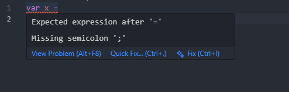

# Dash Highlights

**Dash Highlights** adds beautiful syntax highlighting for the **Dash programming language** (`.dsh` files) in Visual Studio Code.

This extension makes your Dash code easier to read by highlighting keywords, numbers, strings, operators, and comments — all styled according to your active VS Code theme.

---

## ✨ Features

- 🖋️ **Keywords** — Highlights language structures like `if`, `else`, `for`, `while`, `print`, `var`, etc.  
- 💬 **Comments** — Supports both single-line (`//`) and block (`/* ... */`) comments.  
- 🔢 **Literals** — Highlights numbers, strings, booleans (`true`, `false`), and `nil`.  
- ⚙️ **Operators** — Color-coded mathematical and comparison operators (`+`, `-`, `*`, `/`, `==`, `!=`, `<`, `>`).  
- 🧩 **Custom file icon** — Displays a unique Dash icon beside `.dsh` files in VS Code’s explorer.  
- 🎨 **Works with any theme** — Light or dark mode, the syntax integrates seamlessly.

---

## 🧩 Example



---

## 📦 Installation

### 🔹 Option 1 — Local VSIX install
1. Build your extension:
   ```bash
   vsce package
   ```
2. In VS Code, open the Command Palette (`Cmd+Shift+P` / `Ctrl+Shift+P`).
3. Select **“Extensions: Install from VSIX…”**.
4. Choose the generated `dash-highlights-*.vsix` file.

### 🔹 Option 2 — Marketplace (after publishing)
1. Open the Extensions sidebar (`Ctrl+Shift+X` or `Cmd+Shift+X`).
2. Search for **Dash Highlights**.
3. Click **Install**.

---

## ⚙️ Language Details

| Property | Value |
|-----------|-------|
| **Language ID** | `dash` |
| **File extension** | `.dsh` |
| **Scope name** | `source.dash` |

---

## 🧠 Requirements

No dependencies — Dash Highlights runs natively in Visual Studio Code.

---

## 🧩 Known Issues

- Multi-line string highlighting not yet implemented.  
- No IntelliSense or auto-completion .

---

## 🗒️ Release Notes

### **1.0.0**
- Initial release of Dash Highlights
  - Syntax highlighting for keywords, operators, strings, numbers, booleans, and comments
  - Support for `.dsh` files
  - Compatible with all VS Code themes

---

## 💡 Contributing

Contributions are welcome!  
If you’d like to improve Dash Highlights or add new features (like IntelliSense or formatting), open an issue or pull request on GitHub.

---

## 📘 License

MIT License © 2025 Samuel Courchesne

---

**Enjoy writing Dash with clean, vivid syntax highlighting!**
